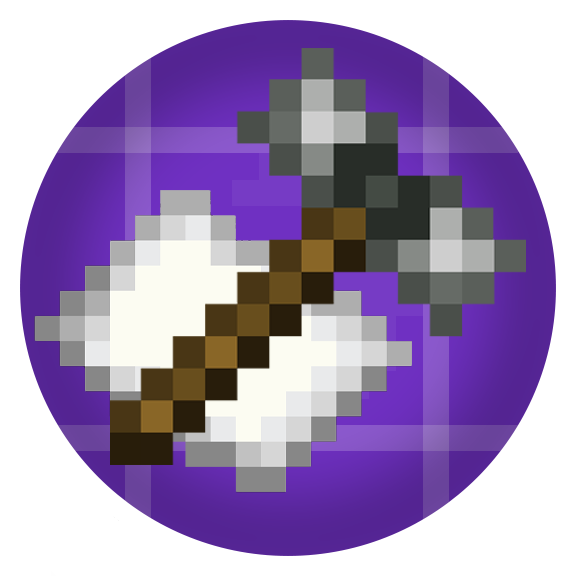

<h1 align="center">RTStructures Framework   
	
	
	
    
      
</h1>

Welcome to JAW Lab, a mod offering a variety of useful laboratory blocks: code doors, key doors and keycard with network connections.

Also, mod adds many decoration blocks and some interactable items.

&nbsp;

  

<h1></h1>
<h4 align="center">Find out more about JAW Mods on my <a href="https://www.curseforge.com/members/classic_akk_/projects">Curseforge</a> or <a href="https://modrinth.com/user/classicAkk">Modrinth</a> Page</h4>
<h4 align="center">Fabric port currently not available :(</h4>